# automaTIGO
La automatización de procesos realizados en Tigo B2B Colombia gobierno.
El siguiente proyecto tiene como objetivo automatizar la realización de informes y reporte de errores o datos incongruentes Tigo Colombia B2B gobierno, para ello se utilizan las herramientas de automatización de procesos con Python y Excel.

A continuación se detallan los pasos para la instalación y uso de la herramienta, además de las instrucciones para contribuir al proyecto y solucionar problemas comunes.

# Tabla de contenidos
- [automaTIGO](#automatigo)
- [Tabla de contenidos](#tabla-de-contenidos)
- [Instalación](#instalación)
  - [Requisitos](#requisitos)
    - [Hardware](#hardware)
    - [Software](#software)
  - [Mac OS o Linux](#mac-os-o-linux)
    - [Pyinstaller](#pyinstaller)
- [Antes de empezar](#antes-de-empezar)
- [Data.json](#datajson)
  - [Coordenadas](#coordenadas)
- [Uso](#uso)
  - [Interfaz](#interfaz)
  - [Ejecución](#ejecución)
    - [OPP](#opp)
    - [Backlog](#backlog)
    - [Clientes](#clientes)
    - [Opciones](#opciones)
- [Contribución](#contribución)
  - [Distribución del código fuente](#distribución-del-código-fuente)
    - [Excel](#excel)
- [Solución de problemas](#solución-de-problemas)
  - [Errores comunes](#errores-comunes)
  - [Preguntas frecuentes](#preguntas-frecuentes)


# Instalación
Para la instalación de la herramienta se deben seguir los siguientes pasos:

1. Acceder a la carpeta en donde se encuentra alojado el código fuente de la herramienta.
2. Guardar dicha carpeta en el lugar deseado.
3. Descargar Python 3.11 para poder ejecutar el código fuente. Se puede descargar tanto de la página oficial de [Python](https://www.python.org/downloads/) como de la Microsoft Store.
4. Descargar las librerías necesarias para el funcionamiento de la herramienta. Para ello ejecutar el comando `pip install -r requirements.txt` en la consola de comandos de Windows.
  
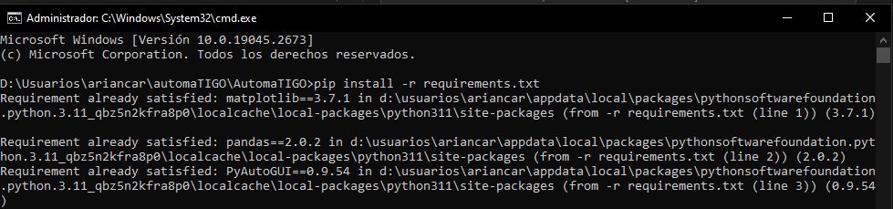

Para abrir la consola de Windos en la carpeta del aplicativo solamente se debe dar clic en la barra de direcciones y escribir "cmd" y dar enter.

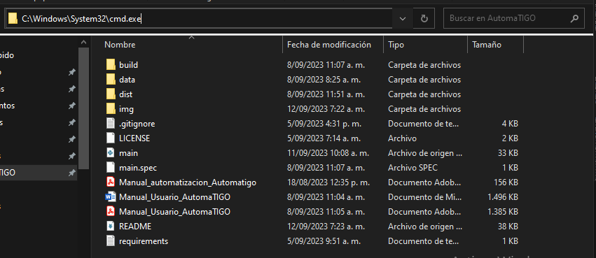

Después de esto se debe esperar un momento para que se instalen las librerías necesarias para el funcionamiento de la herramienta. Si se utiliza un dispositivo Mac OS o Linux se debe tener en cuenta que se debe cambiar una línea de código en el archivo "main.py", para más información ver [Mac OS o Linux](#mac-os-o-linux).

Por último, para ejecutar el código fuente se debe ejecutar el comando `python main.py` en la consola de comandos de Windows. Desde aquí se debe configurar la herramienta para que funcione correctamente, para más información ver [Antes de empezar](#antes-de-empezar).

## Requisitos

### Hardware

- Procesador Intel Core i5.
- Memoria RAM 8,00 GB.
- Disco duro 500 GB.
- Internet 10 Mbps.

### Software

- Windows 10 (64 bits) (si se desea usar el ejecutable, pero el código fuente funciona en cualquier sistema operativo).
- Python 3.11 (si se desea ejecutar el código fuente).
- Google Chrome 87 (64 bits) u Opera GX LVL5.
- Excel 2016 (32 bits).
- Visual Studio Code 1.52 (si se desea ejecutar el código fuente).
- Git 2.30 (si se desea ejecutar el código fuente y contribuir al proyecto).

## Mac OS o Linux

El aplicativo funciona correctamente en Mac OS o Linux, pero para ello se debe tener en cuenta que se debe cambiar una línea de código en el archivo "main.py". Para ello se debe seguir los siguientes pasos:

```python
# Buscar cada línea de código que contenga "subprocess.run" y eliminar "shell=True" con la coma.
# Pueden utilizar bloc de notas para buscar la línea de código, con ctrl + f.

subprocess.run([so[sistemaOperativo]["subprocess.run"], so[sistemaOperativo]["notas"], nombreArchivo], shell=True)
subprocess.run([so[sistemaOperativo]["subprocess.run"], nombreArchivo], shell=True)

```

La idea es solamente quitar la parte de "shell=True" para que funcione correctamente.

Para ejecutar el código fuente en Mac OS o Linux se debe ejecutar el comando `python3 main.py` en la consola de comandos.

### Pyinstaller

Para crear el ejecutable de Mac OS o Linux se debe seguir los siguientes pasos:

1. Tener el código fuente en la carpeta deseada.
2. La librería de Pyinstaller se descarga con los requerimientos, por lo que no es necesario instalarla.
3. Ejecutar el comando `pyinstaller --onefile main.py` para crear el ejecutable. (en la carpeta en donde se encuentra el código fuente, seguir los pasos de [Abrir consola de comandos](#instalación))
4. Se creará una carpeta llamada "dist" en donde se encontrará el ejecutable.
5. Guardar dicho ejecutable en la carpeta de la empresa.

# Antes de empezar
Antes de empezar a utilizar la herramienta se deben tener en cuenta los siguientes aspectos:

 - Se deben confirmar todos los requerimientos de la herramienta (ver [Requisitos](#requisitos)).
 - Se debe tener en cuenta que la herramienta está diseñada para funcionar en la empresa de TIGO, por lo que si se desea utilizar en otro contexto no funcionará nada más que para ver el código fuente.
 - El archivo "data.json" contiene variables que se utilizarán a lo largo de la ejecución de la herramienta, por lo que se debe tener en cuenta que si se desea cambiar algún dato se debe hacer con cuidado, ya que puede afectar el funcionamiento. Para más información ver [Data.json](#datajson).
 - Se debe tener en cuenta que la sesión de Salesforce de TIGO debe estar previamente iniciada, ya que si no se encuentra iniciada no se podrá acceder a los links que se utilizan en la herramienta. También se debe acceder a esta parte a través de Excel para que se puedan acceder a los datos web.

Para mayor información sobre qué hacer antes de utilizar la herramienta se puede hacer uso de la función [Antes de empezar](#opciones), la cual se va a explicar a continuación:

Para abrir dicha función se debe dar clic a opciones y luego a "Antes de empezar", después se abrirá una ventana en donde se deben seguir los siguientes pasos:


1. Sesión en salesforce: Esta función lo que permite es que se abra una página de salesforce en donde se solicitará el nombre de usuario y la contraseña. Es importante tener en cuenta que siempre que se descarguen archivos de Salesforce se debe tener la sesión iniciada, esto para que los clics que se hagan en la página se puedan realizar correctamente.


De ser posible guardar la contraseña en el navegador predeterminado, no es una práctica recomendada, pero para el uso de la herramienta es necesario.

1. Coordenadas: Una vez iniciada la sesión de salesforce es momento de definir las coordenadas según la pantalla, se recomienda que el navegador esté en pantalla completa para que los links se abran de dicha manera siempre. Al momento de ejecutar la función se recomienda no utilizar el mouse para algo más que las coordenadas, ya que se puede afectar el funcionamiento de la herramienta.

  Al momento de ejecutar la función debe seguir los siguientes pasos inmediatamente:

   1. Dar clic en el botón de "Actualizar".

   

   2. Dar clic a las opciones de la derecha de la página de Salesforce.
      
   

   3. Seleccionar la opción de exportar.

   

   4. Seleccionar la opción de "solo detalles".
   
   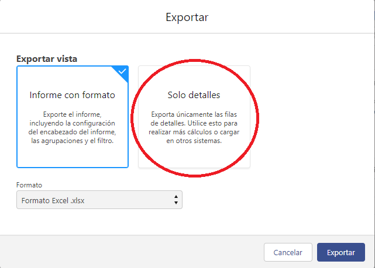

   5. Dar clic en el botón de "Formato".
   
   

   6. Seleccionar la opción de "xlsx".

   

   7. Dar clic en el botón de "Exportar".

   
   
   Se va a descargar el archivo, si no se desea descargar oprimir **ctrl + w** para cerrar la pestaña.

Es importante solamente realizar esta serie de clic para el correcto funcionamiento del aplicativo, después de estos clics oprimir **alt + tab** y esperar al mensaje de "Coordenadas actualizadas correctamente" en el apartado de Log. Si se siguieron los pasos correctamente se abrirá el archivo con las coordenadas actualizadas, cuando se abra el archivo si no se desea editar nada solamente cerrar el archivo.

3.  Carpeta de descargas: Se debe definir cómo se llama la carpeta de descargas por defecto del computador, solamente selecciona la carpeta que se desee y dar clic en aceptar. Teniendo en cuenta esta carpeta es que se extraen los informes descargados de Salesforce. Esta carpeta se puede cambiar en el navegador predeterminado, en el caso de Google Chrome se puede hacer en la siguiente ruta: "chrome://settings/downloads", pero es recomendable dejarlo en la carpeta de descargas por defecto.


1. Variables: Una vez definidas las coordenadas siguen las variables, estas se encuentran en el archivo data.json, para más información ver [Data.json](#datajson). En el caso que se desee cambiar una variable este sería el momento, de lo contrario se puede omitir esta función; sin embargo, es recomendable revisar que exista el archivo antes de iniciar a utilizar la herramienta.

2. Configurar Excel: Esta función abre el archivo correspondiente a DRB, para poder conectar con la API de salesforce es necesario que se inicie sesión, para ello seguir los siguientes pasos:
   
   1. Dirigirse a la pestaña de "Consulta" y dar clic en "Actualizar".
   2. Se abrirá una ventana en donde se debe dar clic en "Iniciar sesión".
   3. Se abrirá una página de Salesforce en donde se debe iniciar sesión con el usuario y la contraseña. Se debe colocar la url adicional de la página de Salesforce, en este caso es **tigob2b**.
   4. Después, pedirá el usuario y contraseña o iniciar sesión por DA, seleccionar la opción que aplique.
   5. Iniciar sesión normalmente con el usuario y la contraseña.
   6. Se abrirá una página en donde se debe dar clic en "Permitir".
   7. Con esto se habrá iniciado sesión y se podrá utilizar la herramienta en Excel.

3. Configurar carpeta de data: Esta función lo que hace es abrir la carpeta de "data" para que se pueda acceder a los archivos que se necesitan para el funcionamiento de la herramienta. En el caso de que no exista dicha carpeta se debe solicitar a un compañero que cuente con la carpeta. Si desean cambiar de lugar la carpeta tener en cuenta de poner dicha ruta en el archivo "data.json".


Se debe cerrar el aplicativo y volver a ejecutar para que todos los nuevos datos se guarden para el siguiente uso. Después de esto se puede comenzar a utilizar la herramienta, para más información ver [Uso](#uso).

# Data.json

Al acceder al archivo "data.json" se encuentran varias categorías, cualquiera de estos datos se pueden cambiar teniendo las siguientes recomendaciones antes de hacerlo:

- **carpeta:** Esta contiene las carpetas donde se descargan los archivos y dónde se ubican los informes.


- **archivos:** Esta contiene los nombres tanto de los informes como de los archivos que se descargan y luego se utilizan en la macro de Excel, además, tiene el mismo archivo de data.json y los respectivos manuales.


- **macros:** Esta contiene los nombres de las macros que se utilizan en el archivo de Excel.


- **columnas:** Esta contiene los nombres de las columnas que se utilizan en el archivo de Excel. Estas se utilizan en todos los archivos, así que se debe cambiar respectivamente en cada uno de ellos.
  


- **link:** Esta contiene los links de las páginas de Salesforce que se utilizan en la herramienta.
  


- **hoja:** Esta contiene los nombres de las hojas de Excel que se utilizan en la herramienta.


- **tabla:** Esta contiene los nombres de las tablas de Excel que se utilizan en la herramienta. Para tener en cuenta, solamente se utilizan tablas dinámicas en este aplicativo.
  


- **saludo:** Esta contiene los mensajes que se envían con los datos copiados en el portapapeles. Si se desea editar alguno de los mensajes solamente es necesario cambiar el texto que se encuentra entre comillas.


- **tiempoEspera:** Esta contiene todo los definidos de cada vez que se utiliza la función de sleep, es decir, el tiempo que se espera para que se cargue una página, se descargue un archivo o se copie un dato en el portapapeles. Si se desea cambiar alguno de los tiempos solamente es necesario cambiar el número, esto por si se desea que la herramienta funcione más rápido o más lento, ya sea por la conexión a internet o por la velocidad del computador.
  


- **so:** Esta contine los nombres de los sistemas operativos que se utilizan en la herramienta. Esto para funcionar correctamente con la librería de subprocess y abrir los archivos en el sistema operativo que se esté utilizando.


## Coordenadas

Este archivo está separado para mejorar la visualización de las coordenadas.

- **coordenada:** Estas son las coordenadas para el paso a paso del botón de descargar en la página de Salesforce. Se debe tener en cuenta que estas coordenadas son para una pantalla de 1366 × 768, por lo que si se desea utilizar en otra pantalla se deben cambiar las coordenadas.

Para cambiarlas se puede utilizar la extensión de google chrome de ["Mouse Coordinates"](https://chrome.google.com/webstore/detail/mouse-coordinates/mfohnjojhopfcahiddmeljeholnciakl) y luego se copian las coordenadas en el archivo "data.json" (teniendo en cuenta sumar 100px para la coordenada "x" y, si se tiene Opera GX, 40px para la coordenada "y").

También, para más comodidad, solamente utilizar la función de antes de empezar para definir las coordenadas según [Antes de empezar](#antes-de-empezar).


# Uso
En el caso de que se cuente con algún tipo de antivirus, es probable que se muestre una ventana de advertencia, en este caso se debe dar clic "Ejecutar de todas formas". Esto se debe a que el aplicativo no está firmado, por lo que el antivirus no lo reconoce como un aplicativo seguro. Esto no ocurre si se utiliza el código fuente, por lo que se recomienda utilizar el mismo si se desean evitar este tipo de inconvenientes.

Al momento de utilizar la aplicación, terminando de configurar todas las variables de data.json, se ejecutará el archivo main.exe y se abrirá la siguiente ventana:


Después de esperar un momento ya se habrá ejecutado el aplicativo y se abrirá el respectivo aplicativo:


Si es la primera vez que se utiliza es indispensable hacer todo el proceso de [Antes de empezar](#antes-de-empezar), ya que si no se hace no se podrá utilizar la herramienta correctamente. Una vez se haya hecho este proceso se puede comenzar a utilizar la herramienta, después de cerrar y volver a abrir el aplicativo no será necesario hacer el proceso de antes de empezar.

## Interfaz
La interfaz de la herramienta se divide en 4 partes:

La primera parte es la barra de menú, en esta se encuentran las opciones de "OPP", "Backlog", "Clientes" y "Opciones". Cada opción tiene un submenú que se despliega al dar clic en la opción. Se explicará más a detalle cada opción en la sección de [Ejecución](#ejecución). Además de tener los tres botones de la parte superior derecha que son "Minimizar", "Maximizar" y "Cerrar".


La segunda parte es el apartado de "Comparación", en este se van a mostrar los datos que se comparan al momento de seleccionar las opciones vistas anteriormente. Se podrá acceder a los datos tanto de "Hoy" como de la "semana pasada" a través de los respectivos botones.


La tercera parte es el apartado de "Datos", en este se muestran los datos extraídos de la tabla dinámica de Excel. Todos los datos que se muestren en este apartado se han copiado en el portapapeles, por lo que se pueden pegar en cualquier otro archivo o chat.


La cuarta parte es el apartado de "Log", en este se muestra el paso a paso de las funciones que se están ejecutando en el aplicativo. En el caso de que se presente algún error o se realice una acción, se mostrará en este apartado.


## Ejecución

Al momento de ejecutar el aplicativo se abrirá la ventana principal, en esta se debe seleccionar la opción que se desea ejecutar, a continuación se explicará cada una de ellas:

### OPP
- **Actualizar Opp General:** Esta función lo que hace es acceder al link de la página de Salesforce de "OPP General" y descargar el archivo de Excel, después se ejecuta la macro que actualiza el informe y se guarda el archivo. Esta función abre automáticamente el archivo, por lo que no habrá necesidad de abrirla manualmente. Es importante que al momento de descargar el archivo no se manipule el mouse, ya que se puede afectar el funcionamiento de la herramienta.


  
- **Candidatos Fast Track:** Esta función lo que hace es acceder a la tabla dinámica que muestra los datos que aplican para fast track, después se copian los datos y se muestran en el apartado de "Datos".


- **Oportunidades próximas a vencer:** Esta función lo que hace es acceder a la tabla dinámica que muestra los datos de las oportunidades que están próximas a vencer, después se copian los datos y se muestran en el apartado de "Datos".


- **Productos en $0:** Esta función lo que hace es acceder a la tabla dinámica que muestra los datos de los productos que están en $0, después se copian los datos y se muestran en el apartado de "Datos".


- **Oportunidades con productos en $0:** Esta función lo que hace es acceder a la tabla dinámica que muestra los datos de las oportunidades que tienen productos en $0, después se copian los datos y se muestran en el apartado de "Datos".


- **Productos en -:** Esta función lo que hace es acceder a la tabla dinámica que muestra los datos de los productos que están en -, después se copian los datos y se muestran en el apartado de "Datos".


- **Mostrar comparación OPP general:** Esta función trae la comparación entre dos dataframes que seleccione el usuario a través de mostrar los datos que solo aparecen en una tabla en el apartado de "Comparación". Además de que realiza dos gráficas que se muestran por fuera del aplicativo con el total de cada tipo de producto.


Los datos de los gráficos no se muestran en la imagen por seguridad. Prometo que si hay datos en los gráficos.

Los botones muestran los nombres de los archivos, estos se crean por defecto con la fecha, pero si es necesario se puede cambiar el nombre para que se pueda identificar mejor.


- **DRB:** Esta función lo que hace es actualizar la tabla que trae los datos del mismo salesforce y acceder a la tabla dinámica que muestra los datos de las oportunidades que aplican para DRB, después se copian los datos y se muestran en el apartado de "Datos".
  


### Backlog 

- **Actualizar backlog (sin el archivo descargado):** Esta función lo que hace es acceder al link de la página de Salesforce de "Backlog" y descargar el archivo de Excel, después se ejecuta la macro que actualiza el informe y se guarda el archivo. Esta función abre automáticamente el archivo, por lo que no habrá necesidad de abrirla manualmente. Es importante que al momento de descargar el archivo no se manipule el mouse, ya que se puede afectar el funcionamiento de la herramienta.


- **Mostrar comparación Backlog:** Esta función crea el dataframe del día de hoy, por lo que se recomienda que se ejecute después de haber actualizado el informe, luego permite que el usuario seleccione dos dataframes para luego comparar los datos y mostrar aquellos que solo aparezcan en una tabla en el apartado de "Comparación".


Aquí también se puede seleccionar con qué archivo se desea comparar, en el caso de que se desee comparar con un archivo que no sea el de la semana pasada.


### Clientes

- **Account Plan:** Esta función lo que hace es acceder al link de la página de Salesforce de "Account Plan" y descargar el archivo de Excel, después se ejecuta la macro que actualiza el informe, se extraen los datos de los clientes con -70% y se muestra en el apartado de "Datos". Esta función abre automáticamente el archivo, por lo que no habrá necesidad de abrirla manualmente. Es importante que al momento de descargar el archivo no se manipule el mouse, ya que se puede afectar el funcionamiento de la herramienta.


- **Mostrar comparación Account Plan:** Esta función crea el dataframe del día de hoy, por lo que se recomienda que se ejecute después de haber actualizado el informe, luego permite que el usuario seleccione dos dataframes para luego comparar los datos y mostrar aquellos que solo aparezcan en una tabla en el apartado de "Comparación".

- **SoW:** Esta función lo que hace es actualizar la tabla que trae los datos del mismo salesforce, se extraen los datos de los clientes con -70% y se muestra en el apartado de "Datos". Esta función abre automáticamente el archivo por lo que no habrá necesidad de abrirla manualmente. Es importante que al momento de descargar el archivo no se manipule el mouse, ya que se puede afectar el funcionamiento de la herramienta.

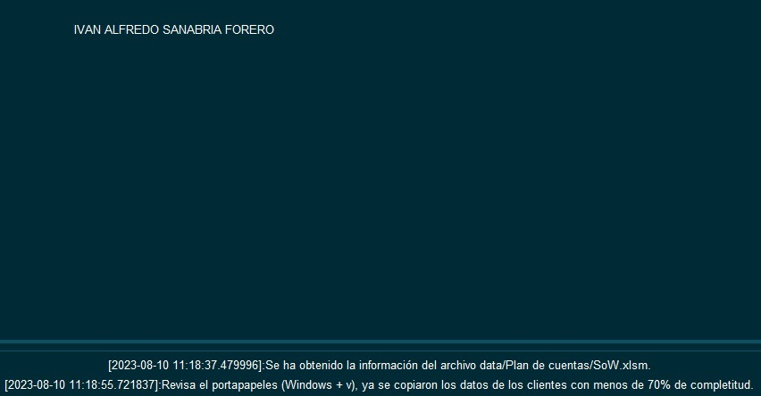

- **Mostrar comparación SoW:** Esta función crea el dataframe del día de hoy, por lo que se recomienda que se ejecute después de haber actualizado el informe, luego permite que el usuario seleccione dos dataframes para luego comparar los datos y mostrar aquellos que solo aparezcan en una tabla en el apartado de "Comparación".

### Opciones


- **Manual de usuario:** Esta función lo que hace es abrir el archivo PDF que contiene el Manual de usuario de la herramienta, es decir, este archivo.

- **Antes de empezar:** Esta función lo que hace es abrir el archivo PDF que contiene el Manual de automatización de la herramienta, es decir, el manual que explica cómo hacer el paso a paso de nuevas automatizaciones. Además, de mostrar un breve resumen de lo que se debe hacer antes de comenzar a utilizar la herramienta.

- **Eliminar dataframes antiguos:** Esta función lo que hace es eliminar los archivos .pkl mayores a un mes de creación, esto se hace para que no se acumulen y ocupen espacio en el disco duro. Para guardar dataframes específicos se pueden guardar en otra carpeta o cambiarles de nombre.

- **Abrir carpeta de informes:** Esta función lo que hace es abrir la carpeta donde se guardan los informes de OPP y Backlog, es decir, la carpeta de "data" completa.

- **Cambiar variables del programa:** Esta función lo que hace es abrir el archivo "data.json" para que se puedan cambiar las variables que se necesiten.

- **Repositorio:** Esta función lo que hace es abrir el repositorio de GitHub donde se encuentra el código de la herramienta. Es muy probable que hayas utilizado esa función para llegar acá (aunque bueno, si esto es un PDF puede que no). El código fuente no tiene ningún tipo de restricción, por lo que se puede utilizar para cualquier fin, pero se recomienda que se utilice para el fin que fue creado. Además, el repositorio no contiene la carpeta de data, por lo que si se desea utilizar el código fuente se debe solicitar a un compañero que cuente con la carpeta o con el jefe.

- **¿Cómo agregar más opciones?:** Esta función lo que hace es abrir el archivo referente al informe de automatización que explica cómo hacer el paso a paso de nuevas automatizaciones.

- **Salir:** Esta función lo que hace es cerrar el aplicativo.

# Contribución

Para contribuir en el proyecto solamente se debe editar desde el archivo "main.py", ya que es el único archivo que se utiliza para el funcionamiento de la herramienta. Si se necesita ayuda con el código se puede contactar conmigo para poder ayudar en lo que se necesite.

<!-- En el caso de que se desee contribuir al proyecto, se deben seguir los siguientes pasos:
1. Después de clonar el repositorio y realizar los cambios deseados, se debe ejecutar el archivo "main.py" para probar que todo funcione correctamente.

2. Se debe realizar una pull request con los cambios realizados y esperar a que se apruebe (para realizar el pull request se debe tener una cuenta de GitHub y seguir este [tutorial](https://www.youtube.com/watch?v=BPns9r76vSI)) (para realizar el cambio se necesita antes tener una cuenta de Github)

3. En el caso de que se desee cambiar por completo el proyecto se recomienda crear un nuevo repositorio para no afectar el funcionamiento de este aplicativo. Si ese es el caso y se desea acompañamiento se puede contactar conmigo para poder ayudar en lo que se necesite.

4. En el caso de que el cambio sea personal se recomienda hacer un fork del repositorio para que se pueda tener una copia personal del mismo.-->

## Distribución del código fuente 

El archivo main.py se encuentra dividido en 4 partes:

1. **importaciones:** En esta parte se importan todas las librerías que se van a utilizar a lo largo del código.
   


2. **funciones principales:** Estas son las funciones que se utilizan en toda la aplicación y son usadas varias veces en la misma.
  


3. **opciones de menú:** Estas son las funciones que se utilizan en cada una de las opciones del menú.


4. **menú:** Esta es la parte en la que se utiliza la librería de tkinter para crear la interfaz gráfica de la aplicación.
   
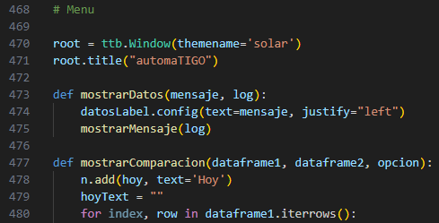
   
Si se desea contribuir al proyecto se debe seguir esta estructura y tener en cuenta que se debe comentar el código para que se pueda entender lo que se está haciendo. Además, el código está comentado en las partes más complicadas de entender, por lo que se debe seguir el mismo estilo de comentarios.

### Excel

**Macros:** Hay dos tipos de macros para los informes, una es para los informes que se descargan a través de la página y otro es para los informes que se actualizan de Excel a través de la API de Salesforce. A continuación se muestran las macros de cada uno de ellos:

***OPP:*** Esta macro está enfocada a los informes que se descargan a través de la página de Salesforce. El paso a paso de la función es el siguiente:

1. Eliminar la hoja "Oportunidades_Abiertas_CO SIN A", para que no se duplique la información.
   


2. Traer la nueva hoja que se acabó de descargar.


3. Definir y crear la tabla que se utilizará en las tablas dinámicas.


4. Definir columnas como "fecha" para que la agrupación de las tablas dinámicas se realice correctamente.


5. Por último, actualizar todas las tablas dinámicas y guardar el archivo.


***Backlog:*** Esta macro está igualmente enfocada a los informes que se descargan a través de la página de Salesforce. El paso a paso de la función es el siguiente:

1. Eliminar la hoja "Negocios_Pendientes_Implementac", para que no se duplique la información.


2. Traer la nueva hoja que se acabó de descargar.


3. Definir y crear la tabla que se utilizará en las tablas dinámicas.


4. Definir columnas como "fecha" para que la agrupación de las tablas dinámicas se realice correctamente.


5. Por último, actualizar todas las tablas dinámicas y guardar el archivo.


***Account plan:*** Esta macro está enfocada a los informes que se descargan a través de la página de Salesforce. El paso a paso de la función es el siguiente:

1. Eliminar la hoja "Account Plan X Porcentaje Mayor", para que no se duplique la información.
   


2. Traer la nueva hoja que se acabó de descargar.


3. Definir y crear la tabla que se utilizará en las tablas dinámicas.


4. Actualizar todas las tablas dinámicas y guardar el archivo.


***SoW y DRB:*** Estos dos informes funcionan a través de la API de Salesforce en excel, por lo tanto, no hay necesidad de descargar dichos archivos a través de la página. El paso a paso de la función es el siguiente:

1. Esperar a que se actualicen los datos de la API de Salesforce. 

2. Actualizar tablas dinámicas.
   


**Tablas:** Las tablas dinámicas que se encuentran en todos los informes se encuentran de la siguiente manera:


Los datos de las primeras columnas se repiten para cada registro que aparezca en este caso, esto facilita el guardado en el dataframe, por lo tanto, se sugiere que no se modifique esto, por lo menos debería estar así al momento en que se solicitan datos en las funciones previamente mencionadas.

**Filtros:** Los filtros que se pueden colocar a cada una de las tablas dinámicas se pueden filtrar de la siguiente manera:

***Ejecutivo:*** Se puede filtrar por ejecutivo, en este caso se debe seleccionar el ejecutivo que se desee y dar clic en "Aceptar".

***Líder:*** Se puede filtrar por líder, en este caso se debe seleccionar el líder que se desee y dar clic en "Aceptar".

Las tablas dinámicas en las que se pueden filtrar por ejecutivo o por líder son las siguientes:

1. General: Esta tabla dinámica se encuentra en la hoja "PRODUCTO X EQUIPO" y se puede filtrar por ejecutivo o por líder.

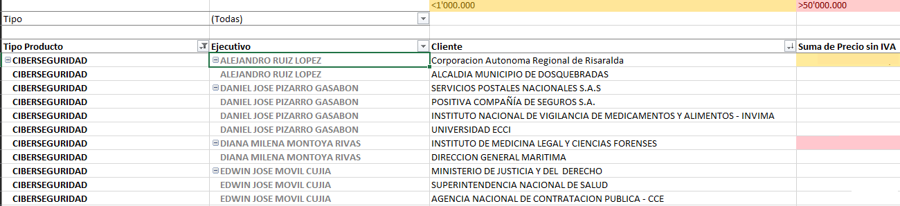

2. Productos en (-): Esta tabla dinámica se encuentra en la hoja "VENTA NETA (-)" y se puede filtrar por ejecutivo o por líder.

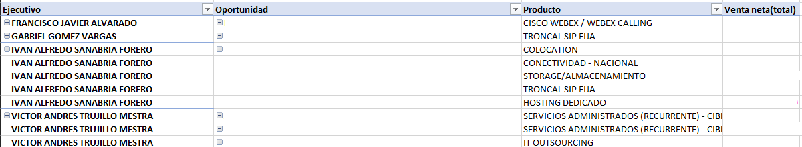

3. Productos en $0: Esta tabla dinámica se encuentra en la hoja "VALORES 0" y se puede filtrar por ejecutivo o por líder.

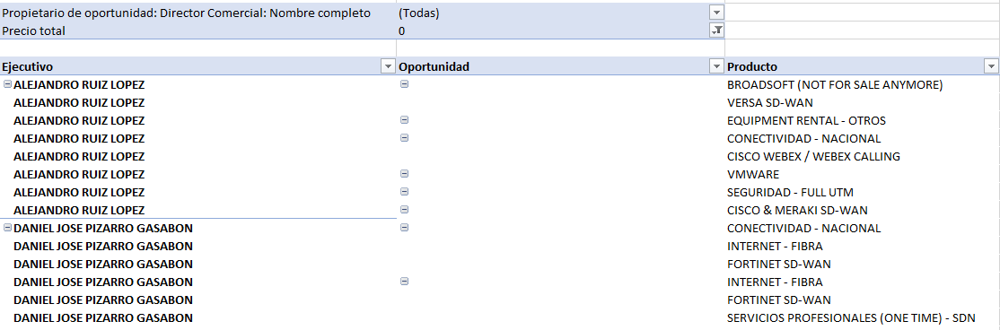

4. Oportunidades en $0: Esta tabla dinámica se encuentra en la hoja "OPORTUNIDADES 0" y se puede filtrar por ejecutivo o por líder.
   
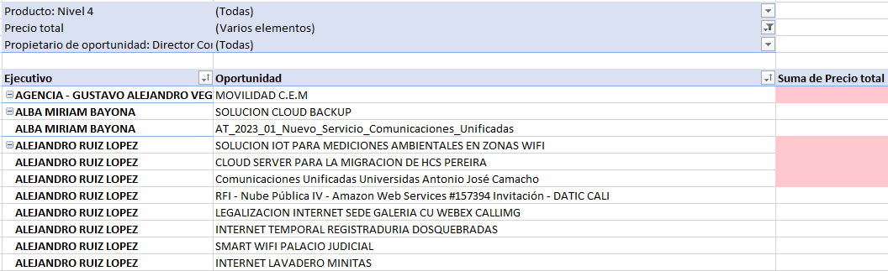

5. Candidatos Fast Track: Esta tabla dinámica se encuentra en la hoja "Candidatos fast track" y se puede filtrar por ejecutivo o por líder.

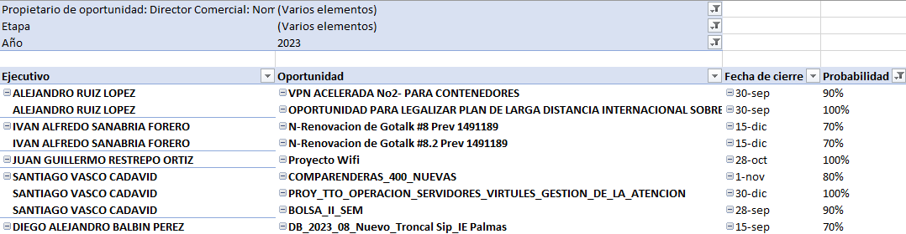

6. Oportunidades próximas a vencer: Esta tabla dinámica se encuentra en la hoja "PROXIMO A VENCER" y se puede filtrar por ejecutivo o por líder.

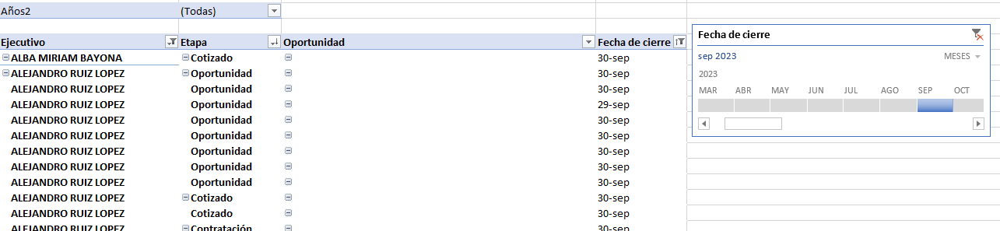

7. DRB: Esta tabla dinámica se encuentra en la hoja "DRB" y se puede filtrar por ejecutivo o por líder.

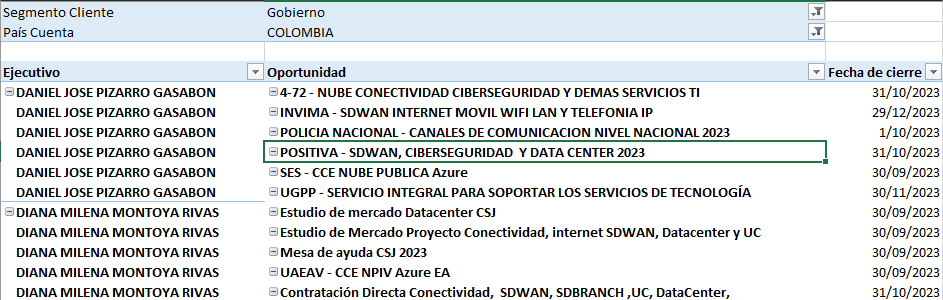

8. Backlog: Esta tabla dinámica se encuentra en la hoja "CASOS A REVISAR" y se puede filtrar por ejecutivo o por líder.

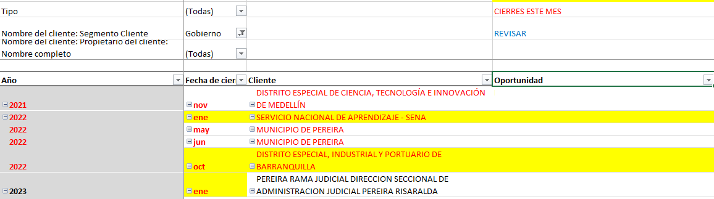

9. Account Plan: Esta tabla dinámica se encuentra en la hoja "Plan de cuentas PROMEDIO" y se puede filtrar por ejecutivo o por líder.

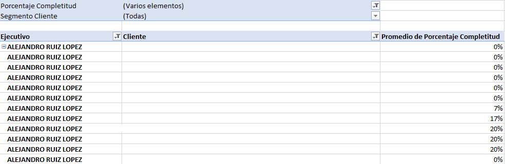

10. SoW: Esta tabla dinámica se encuentra en la hoja "SoW x ejecutivo y %" y se puede filtrar por ejecutivo o por líder.

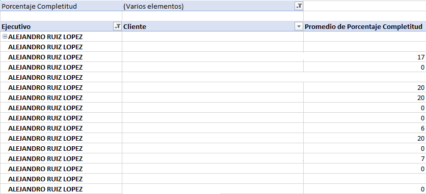

# Solución de problemas

En el caso de que el problema no se encuentre en esta sección, se solicita contactarme para poder solucionarlo. En mi perfil de GitHub se encuentra mi correo electrónico.

## Errores comunes

 **Coordenadas:** Al momento de hacer uso de las funciones que tengan que ver con coordenadas se tiene que tener en cuenta lo visto en [Data.json](#datajson), ya que si se cambian las coordenadas se puede afectar el funcionamiento de la herramienta.

Hay ocasiones en donde las coordenadas no funcionan, si este es el caso se debe hacer lo siguiente:

1. Comprobar que no funcionan (intentando nuevamente y viendo cada clic que hace la herramienta).
2. Si no funcionan se debe repetir el proceso de Antes de empezar para que se vuelvan a guardar las coordenadas.
3. En el caso de que las coordenadas estén bien configuradas, se debe comprobar que el mouse no se mueva mientras se ejecuta la función, ya que esto puede afectar el funcionamiento de la herramienta.
4. Si el problema persiste se debe contactar conmigo para poder solucionarlo.

**Cambio de nombre de variables:** Es importante que si se modifica algún archivo o nombre que haga parte de la carpeta data sea inmediatamente modificado también en el archivo "data.json", ya que si no se hace esto se puede afectar el funcionamiento de la herramienta.

**El link no es correcto:** En el caso de que el link no sea correcto, se puede deber a que se haya actualizado salesforce o que se haya cambiado el nombre de la página. Para solucionar esto solamente basta con cambiar el link en el archivo "data.json" y probar si funciona correctamente.

**No se pudo actualizar el informe:** En el caso en que el informe no se haya actualizado ha de ser por 2 razones:

1. El archivo no se descargó correctamente.
   - Esto se debe a que en el momento de descargar el archivo no haya funcionado correctamente la coordenada de "xlsx", por lo tanto, se debe hacer lo mismo que en el caso de que no funcionen las coordenadas.
   - También se puede deber a que el archivo no se haya descargado correctamente, por lo que se puede descargar manualmente y reemplazarlo en la carpeta de "data".
   - De ambas maneras, ya debe haber quedado solucionado el problema.
  
2. La macro no se ejecutó correctamente.
   - Esto puede ocurrir porque la macro no reconoce la hoja que se desea actualizar, por lo que volviendo a ejecutar la función se soluciona el problema.

De cualquiera de las dos maneras la solución más sencilla es volver a ejecutar la función.

## Preguntas frecuentes

**¿Por qué no se puede utilizar en otro contexto?**

El proyecto está principalmente enfocado a la empresa de TIGO, si se desea utilizar en otro contexto es necesario hacer el respectivo cambio en el código fuente según las necesidades del usuario.

**¿Cómo cambio los estilos?**

Para cambiar los estilos se deben dirigir al archivo principal, en este está la definición de los estilos de la aplicación.

```python	
# Menu Python 
root = ttb.Window(themename='solar')
root.title("automaTIGO")

```

Buscar esta línea y cambiar en "themename" por las funciones que aparecen en la página web oficial de [ttkbootstrap](https://ttkbootstrap.readthedocs.io/en/latest/themes/).

**¿Cómo agrego más opciones?**

Para agregar más opciones es necesario conocer ¿Qué es lo que quieres automatizar?, y ¿Cómo lo quieres automatizar?. Para saber esto puedes revisar el [Manual de automatización](Manual_automatizacion_Automatigo.pdf), este te guiará paso a paso para definir la tarea que desees hacer.

Cuando ya lo hayas leído y desees agregar más funciones, puedes dirigirte a [Distribución del código fuente](#distribución-del-código-fuente) para saber cómo se organiza el aplicativo y seguir dicho orden.

**¿Cómo cambio el nombre de las variables?**

Accede a la opción en el apartado de "Opciones" que dice "Cambiar variables del programa", ahí se abrirá el archivo "data.json" y podrás cambiar las variables que desees.

**¿Cómo accedo a los informes?**

Accede a la opción en el apartado de "Opciones" que dice "Abrir carpeta de informes", ahí se abrirá la carpeta donde se encuentran los informes. Esta carpeta se divide de la siguiente forma:


1. Backlog: Aquí se encuentra el informe de backlog, junto con el archivo que ya se tiene predestinado para ser el que se descargue.


2. dataframes: Aquí se encuentran los dataframes que se utilizan para comparar los datos de la semana pasada con los de hoy. Están separados por cada tipo de informe, es decir, OPP y Backlog.
   

  
3. OPP: Aquí se encuentra el informe de OPP, junto con el archivo que ya se tiene predestinado para ser el que se descargue.
   


4. Plan de cuenta: Aquí se encuentran el informe de Account Plan y el de SoW, junto con el archivo que ya se tiene predestinado para ser el que se descargue.


<!-- # Licencia

Este proyecto está bajo la licencia de MIT License, se puede utilizar para cualquier fin, pero se debe dar crédito al autor original (Ana Maria Riaño Caro). Para más información ver [LICENSE](LICENSE). -->